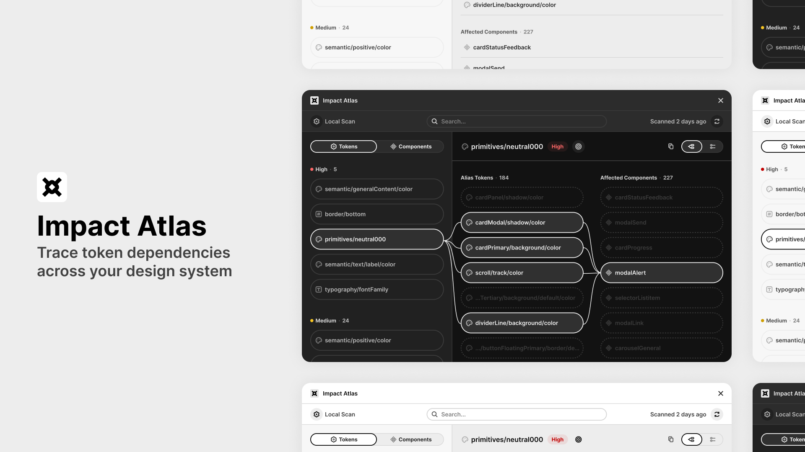
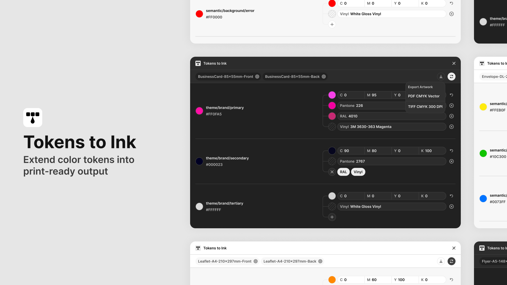
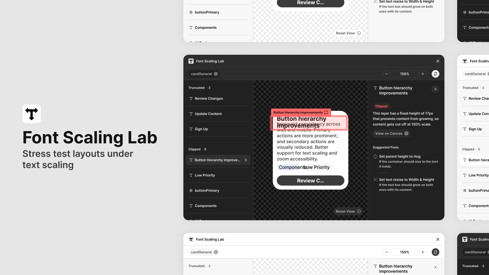

# Design System Figma Plugins

[](https://github.com/rafaelmatosdasilva/rms-ds-figma-plugins/actions/workflows/build.yml)
[](LICENSE)

Figma plugins for design-system work.

Each one is published on the Figma Community — install from there if you just want
to use it. This repo holds the source, and lets you sideload the plugins directly
(useful if your org gates Community plugins behind an approval process).

They run entirely inside your Figma file. No network access, nothing sent anywhere.

---

## Impact Atlas

**Trace token impact across your design system**

[Open in Figma Community →](https://www.figma.com/community/plugin/1643205375147564994/impact-atlas)

When you change a token, it's often unclear what depends on it, what's affected,
and how far those changes spread. Impact Atlas reveals the structure and
relationships behind your design system, showing how tokens and components
connect and how changes propagate through your files.

- Scans your file's variables and components, plus the variable collections in any
  connected libraries, so you can search and trace impact paths.
- Calculates impact tiers (High / Medium / Low) based on how deep and wide each
  token's alias chain runs, weighted by how many components use it.
- Shows dependency chains from tokens through aliases to components, with an
  optional deeper scan that adds canvas usage counts.
- Copy a plain-text summary of any token or component's tier, aliases, and bound
  components for audits or documentation.



---

## Tokens to Ink

**Extend color tokens into print-ready output**

[Open in Figma Community →](https://www.figma.com/community/plugin/1627749854119339734/tokens-to-ink)

Design system colors often stay consistent in Figma but break in print. Different
tools, color profiles, and production workflows shift how colors appear between
digital and physical output. Tokens to Ink extends your Figma color variables into
print-ready values, using the same variables you already use.

- Reads your color variables and suggests CMYK equivalents — accept or override them.
- Add CMYK, Pantone, RAL, and vinyl values to your tokens, stored as metadata.
- Reuse stored print values wherever those variables are applied in designs.
- Export selected artwork using mapped values for production-ready output.



---

## Font Scaling Lab

**Stress test layouts under text scaling**

[Open in Figma Community →](https://www.figma.com/community/plugin/1632816540279283797/font-scaling-lab)

Typography systems often work well under ideal conditions but break in real use.
Text resizing, assistive technologies, and changing content cause overflow, broken
layouts, and lost hierarchy. Font Scaling Lab simulates these conditions so you can
test how your typography behaves beyond fixed assumptions.

- No setup required — runs safely on existing layouts without modifying any values.
- Simulates realistic text scaling to mimic zoom and accessibility settings.
- Detects truncation, clipping, and constraint failures caused by fixed dimensions.
- Suggests targeted fixes for each detected issue.



---

## Install

1. Download this repo — green **Code** button → **Download ZIP** (or `git clone`).
2. In the Figma **desktop** app: **Plugins → Development → Import plugin from
   manifest…**
3. Pick the plugin's `manifest.json` — e.g. `apps/impact-atlas/manifest.json`.

That's it. Nothing to install, nothing to build.

Run it any time from **Plugins → Development**.

## Get updates

- **Cloned it?** Run `git pull`, then reopen the plugin in Figma.
- **Downloaded the ZIP?** Download it again and replace the folder.

You only need to re-import the manifest if you move the folder.

### Get notified of new versions

The plugins can't check for updates themselves — they have no network access,
by design. So updates are announced through GitHub releases instead:

1. Click **Watch** at the top of this repo
2. Choose **Custom → Releases**

You'll get an email for each significant release, and
[CHANGELOG.md](CHANGELOG.md) always lists what changed. There's also an Atom feed
at `../../releases.atom` if you'd rather not use GitHub notifications.

Each plugin has its own version, so the numbers won't line up with each other:

- **Whole numbers** (`v4`) match the version published on the Figma Community.
  These are the ones you get notified about.
- **Decimals** (`v4.1`) are small fixes that only exist here — usually shared
  styling corrections. They're tagged but not announced, to keep the
  notifications worth reading. The next Community publish resets the number to a
  whole one and its notes cover everything since.

So if you want every change, `git pull` periodically. If you only want the ones
that matter, watching releases is enough.

To check which build you're running, open **Plugins → Development → Open
console** in Figma — each plugin logs its name and version on startup.

> Installing from the Figma Community instead? Those update automatically —
> sideloading is only needed when your organisation gates Community plugins.

## Building from source

Only needed if you change the code. Requires Node 24 and pnpm:

```sh
pnpm install
pnpm build
```

## Contact

Feedback and ideas are welcome:

- Email — [hello@rafaelmatosdasilva.com](mailto:hello@rafaelmatosdasilva.com)
- LinkedIn — [rafaelmatosdasilva](https://www.linkedin.com/in/rafaelmatosdasilva/)

## License

MIT — see [LICENSE](LICENSE).
